# AWS-RDS-WITH-EKS
Implementation of AWS managed Dadabase RDS with Kubernetes 

### Important things to notes about implementation of Amazon RDS on Kubernetes.
1. Since AWS RDS is a managed Database As A Service, it is thus considered "Production Grade" since it performs better than the traditional installation of MySQL   

## Set Up kubernetes fom Begin.
--- 
- [ ] AWS CLI and Configure
- [ ] Terraform and use the EKS-Terraform Module
- [ ] Install Kubectl
- [ ] Install Ekctl 
- [ ] kubeconfig to connect  `aws eks --region us-east-1 update-kubeconfig --name bnj-cluster`

##### For this particular setup i used Click-Ops to set up RDS see the terraform module to see how to set up RDS in terraform

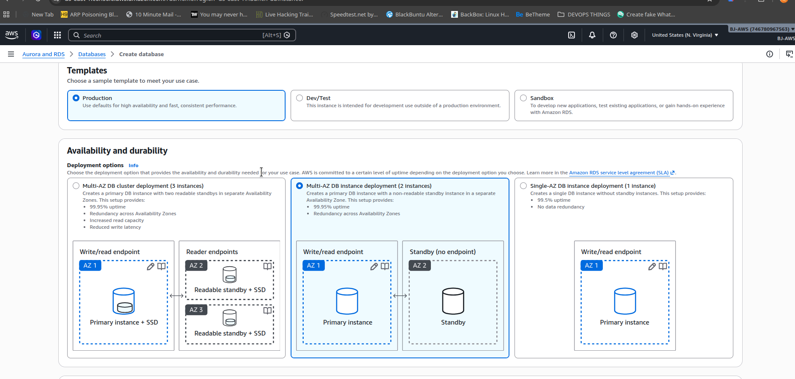

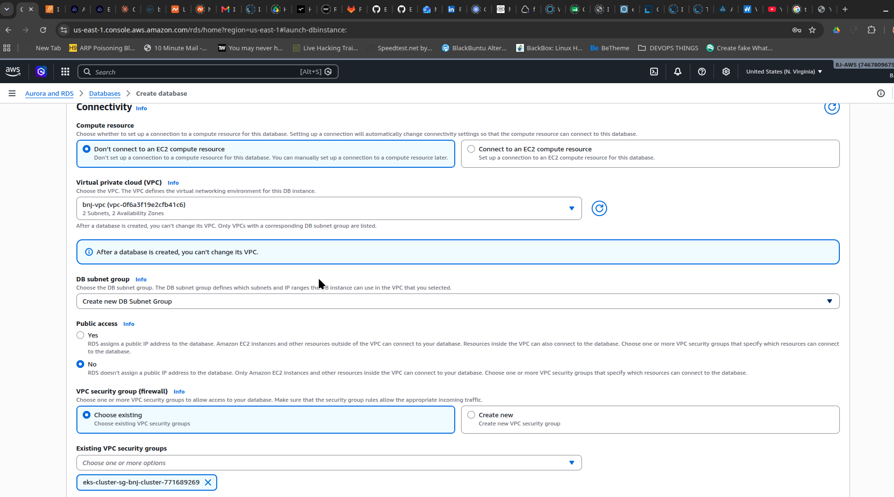

Copy the Endpoint to serve as the ExternalName url address of the database

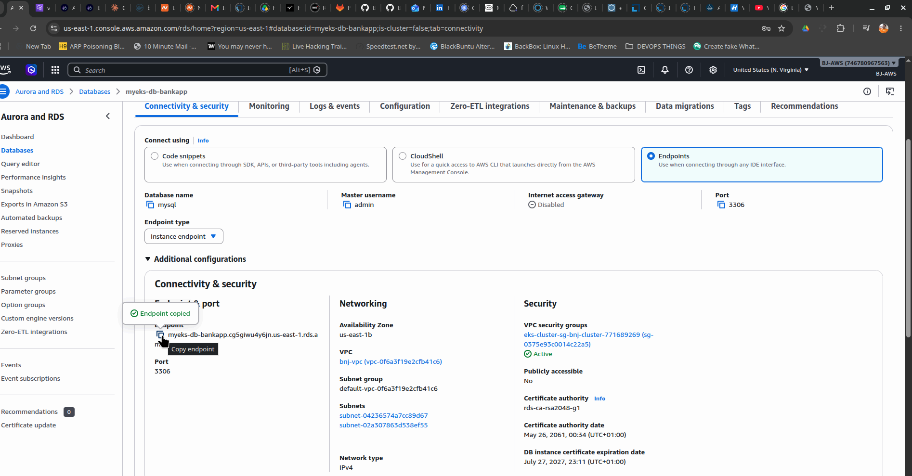

Modify it in the manifest .yaml file accordingly.  Note that security is not the subject matter and the is why the secret `rds-mysql-secret` is so open. also be aware that since it is string Data:, we did not  encode the username and password with base64. 

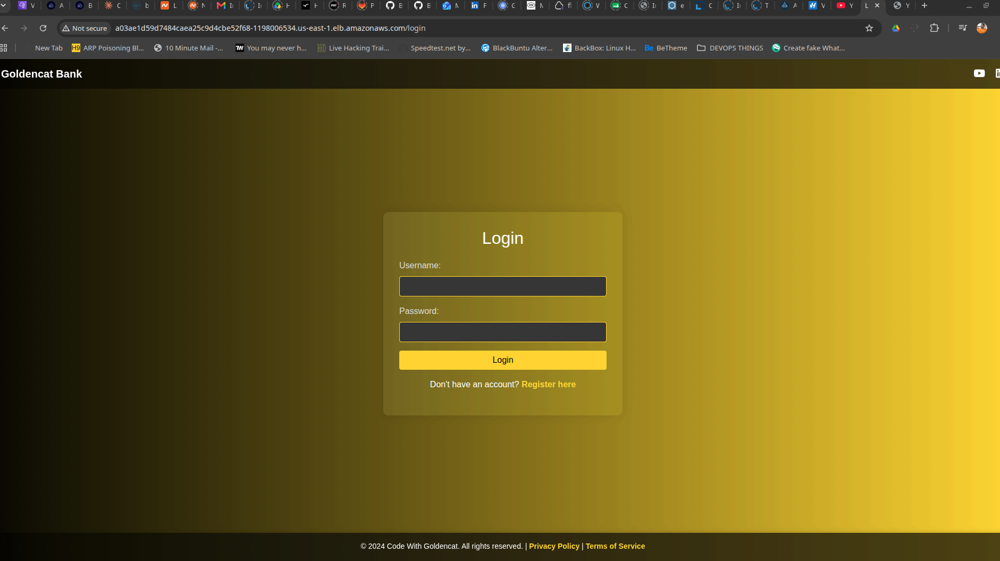

##### service type `ExternalName` was used to capture the rds Enpoint which was copied form AWS
Note that init container was created that will create the database `bankappdb` which is required for the application to start. init container will start and die after its work is done.
##### Also `admin` was used in palce of `root` because that was what i used when creating the database using ClickOps . 
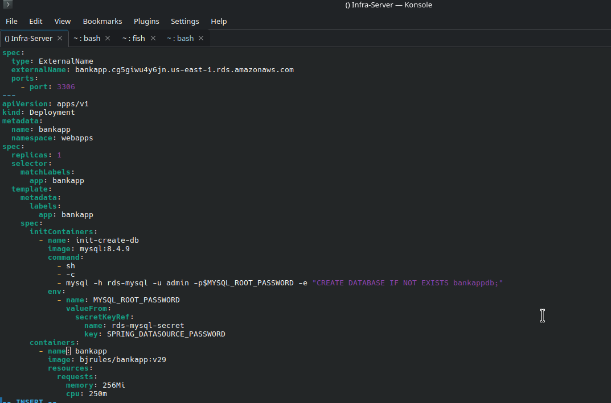

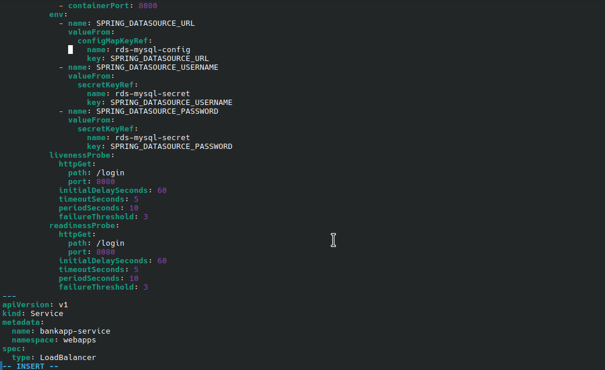

Create all resources using the manifest.yaml
 
 At a point, I faced config challenges, so I deleted the RDS and created another one .... bringing about a change in ExternalName / Endpoint Address  

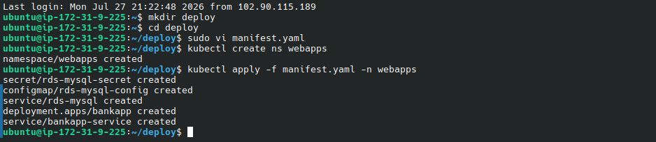

It worked  , i created acoount and gave myself ₦40,000,000 UD :joy:

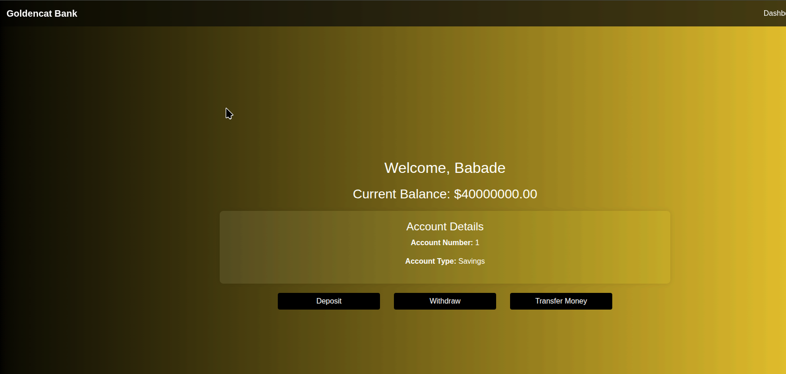

Created test-pod.yaml to really check and login our RDS from CLI..... See Screenshots

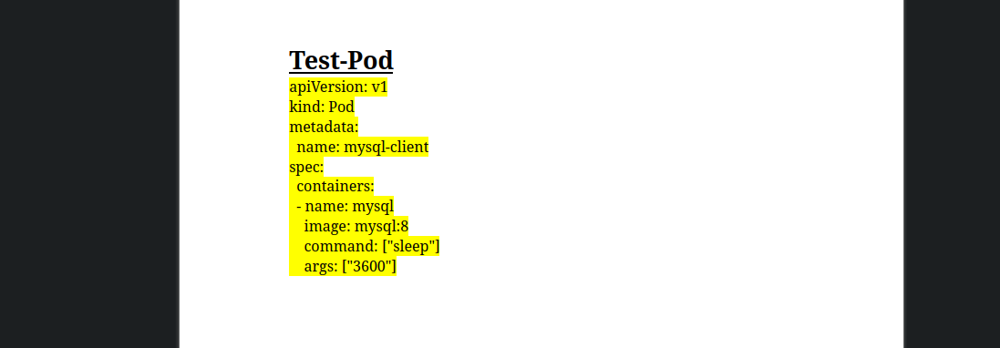

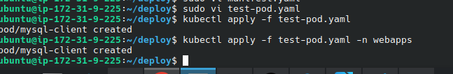

mysql-client container is not running . Note the Sleep:3600 shows the pod will not terminate.

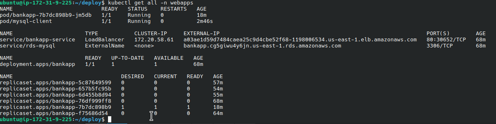

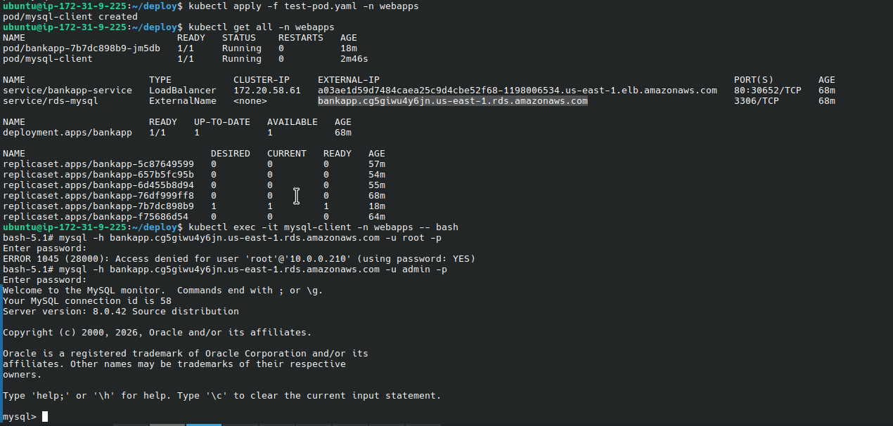

`kubectl exec -it mysql-client -n webapps --bash` to exec into the mysql-client pod

`mysql -h < RDS-ENDPOINT-ADDRESS > -u admin -p` the enter the login password...... see screenshots

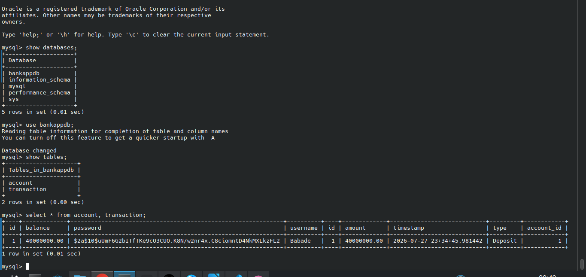

ScreenShots from AWS............

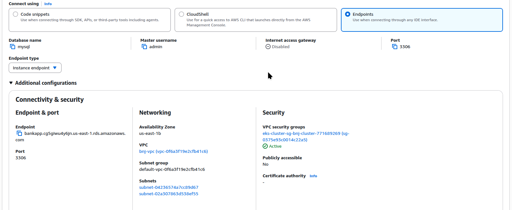

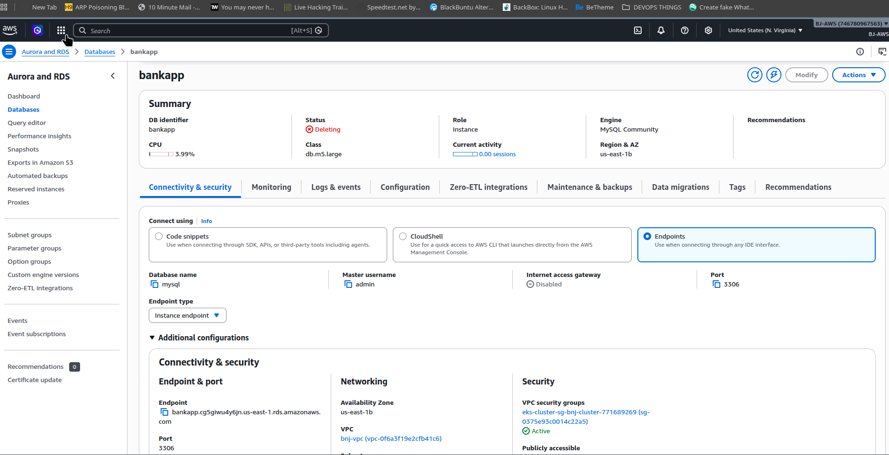

